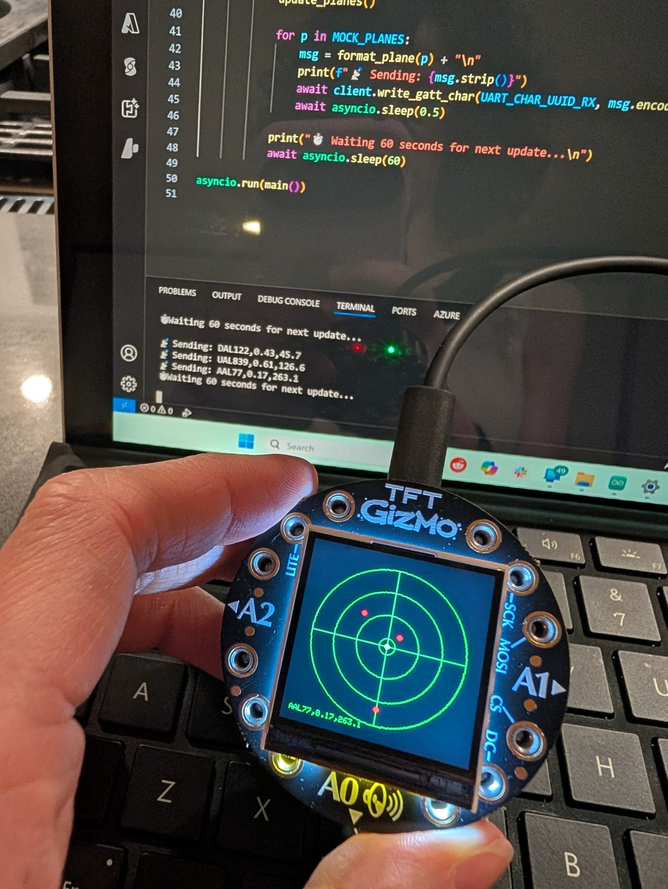

<<<<<<< HEAD
# flight-tracker-bluefruit
Show planes nearby using your Adafruit Circuit Playground Bluefruit and TFT Gizmo.
=======
# ✈️ Plane Tracker: Adafruit Bluefruit + TFT Gizmo

Real-time flight data on a vector-style radar screen, running on the Circuit Playground Bluefruit with the TFT Gizmo. This repo documents the journey from "Hello, screen!" to a fully functional radar tracking nearby flights using Bluetooth and the ADS-B Exchange API.



---

## 🧩 Project Overview

This project consists of:

- **Arduino sketches** that display graphics and parse Bluetooth serial input.
- **Python scripts** that fetch flight data from the ADS-B Exchange API and send it via BLE UART.
- **Assets** for visuals and future expansion.

I organized my code with phase numbers to reflect iterative milestones so others can learn from my build process. Prefixes will match between Arduino and Python folders but titles will explain the code's function.
- Phase 1 (Arduino-only): verify the TFT Gizmo's display screen works with a base image of a radar
- Phase 2: verify that Bluetooth works (UART) by sending some mock data from my computer and printing it on the display screen.
- Phase 3: Cycle through mock plane data via Bluetooth, printing on the radar.
- Phase 4 (Arduino-only): Cycle through mock plane data via Bluetooth, this time updating the radar display with newly-refreshed data
- Phase 5: Push real data from the ADS-B Exchange API to the display.  

---

## 🛠️ Hardware Used

- [Adafruit Circuit Playground Bluefruit](https://www.adafruit.com/product/4333)
- [Adafruit TFT Gizmo Display](https://www.adafruit.com/product/4367)
- Screws: Use *all 12*, especially near VOUT and GND, for reliable contact
- My Surfce Pro laptop (for pushing plane details via Bluetooth)

---

## 📦 Getting Started

### Python Side

```bash
# 1. Install Python dependencies
pip install -r requirements.txt

# 2. Edit your coordinates and API key in .env
# 3. Run the script to fetch & send live data
# 4. Upload the sketch from the last phase into your device (Arduino/5_real_plane.ino)
# 5. Run the live data file from Python
python python/5_real_plane.py
